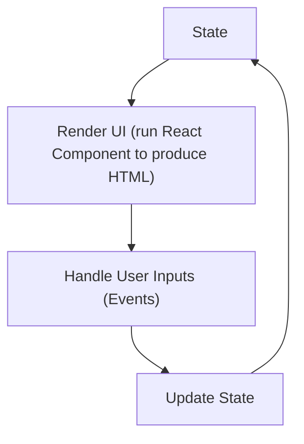

# Events and State

As we have seen so far, React components let you describe what the user interface (UI) with a mixture of HTML and JavaScript. However, up until now, our examples have been static. The UI we rendered did not change in response to user input!

Real web applications need to respond to user actions and update what's displayed. For example, when you click a button, text might change, or a new element might appear. To handle these sorts of changes, we need two core concepts in web programming:

1. **State**: A way to keep track of changing data inside a component.
2. **Events**: A way to listen for and respond to user inputs (like clicks, typing, and other interactions).

> If we imagined our programming as a vending machine, the "state" would be information like *what items are in the machine* and *how much money you have added.* The "events" would be the actions you take that *change* the state, like pressing a button to select an item or inserting a coin in the slot.

Fundamentally, the React model is based on the idea that a GUI program is a cycle, in which each event (user input) triggers a change in the state, which in turn triggers a re-render of the UI:



We’ll start by exploring what "state" is, then learn how to handle events, and finally combine them to build an interactive example.

## State

**State** is data managed by a React component that can change over time. When state changes, the component re-renders, updating the UI to match the new data. State is what makes React dynamic.

> Managing state in web applications is complex business. You can think of "state" as the *current value of all the variables that matter*.
> 
>  State also is important in the real world. For example, the state of a light switch is simple --  either "on" or "off" -- but the state of a lightboard in a theater is more complex, with many possible states (e.g. flood, spot, strobe, etc.). 
> 
> The state of a baseball game could be represented on a box score, with many variables like runs, hits, and errors. But if we were representing a video game, we might add many more variables like player health, score, and level.
> 
> The more complex the system, the more complex the state, and debugging state-related issues is a big part of programming.

The React library provides a special `useState` hook (a hook is a function that lets you "hook" into the React lifecycle) to handle state within a functional component. The `useState` hook returns two things:

1. The current value of the state variable.
2. A function to update that value.

We can “destructure” these two values using array syntax, so typically
you'll see a call like this:

```jsx
const [count, setCount] = useState(0);
```

Or, abstractly:
```jsx
const [VALUE, SETTER] = useState(INITIAL_VALUE);
```

This means:
- `count` is our state variable (initially set to 0).
- `setCount` is a function that updates `count`.

Counterintuitively, we use `const` for the value of the state even though we expect it to change. That is because we are not allowed to set the value of a special "state" variable with the assignment operator `=`. Instead, we use the `setCount` function to update the value.

What's really happening is each time we run the setter function (e.g. `setCount`), React schedules a re-render of the component with the new state value. So, each time our component function runs, `count` will have the most recent value and that value will not change while our UI renders: so we think of it as *constant* from the perspective of the function.

We could rewrite our initial "hello world" function using state like this:

```jsx
import React, { useState } from 'react';
const HelloWorld = () => {
  const [count, setCount] = useState(0);
  return <h1>Hello, World! {count}</h1>;
};
```

Because `setCount` is never called in the system above, the value of `count` will always be `0`. You might try adding a call to `setCount` such as `setCount(count + 1)` to change the value, but in practice, that will lead to an infinite render loop. What we actually need to update the count is a way to update the count in response to a user input: that's where events come in!

## Events
**Events** are user inputs that we can "listen" for in the browser, like the user clicking, typing or scrolling. The "listener" pattern is common in programming: we set up a function to run when an event occurs.

In React, we can listen for events by passing a function to an event handler prop on a JSX element. For example, we might write:

```jsx
<button onClick={doSomething}>Click me</button>
```
or
```jsx
<input onChange={handleChange} />
```

In these examples, `doSomething` and `handleChange` are *functions* that will be called whenever the user clicks the button or types in the input field, respectively.

Here is a simple event listener that uses `window.alert` to show you when a function runs




## A Click Counter

Let's put these concepts together to build a simple click counter. We'll use state to keep track of the number of times a button is clicked, and an event to update that state.

```jsx
const ClickCounter = () => {
    const [count, setCount] = useState(0);
    const handleClick = () => setCount(count + 1);
    return (
        <div>
            <h1>Click Counter</h1>
            <button onClick={handleClick}>Click me</button>
            <p>You clicked {count} times</p>
        </div>
    );
};
```



## Lists (and other Mutable Datatypes) and State

React decides when to re-render a component by comparing the current state to the previous state. If the state has changed, React will re-render the component. That means that it is easy to make mistakes if you use mutable datatypes (like arrays or objects) for state. Imagine an array as as a container, like a notebook with a list of items. If you change the items in the notebook, the notebook itself doesn't change, so React won't know to re-render the component. Instead, you need to create a new notebook with the changes and tell React to use the new notebook.

Here's an example of a common mistake:

```jsx
const [cats, setCats] = useState(["🐱"]);
const addCat = () => {
    // Example of a mistake: DON'T DO THIS!!!
    cats.push("🐱");
    // This won't work, *even if we call setCats*
    // because the array itself has not changed!
    setCats(cats);
  };
```




A good pattern is to always make a copy of a list before you make changes. You can copy a list using
the spread operator like this `const newCats = [...cats]` or by using the `slice` method like this `const newCats = cats.slice()`.

Here is a corrected example:

```jsx
const [cats, setCats] = useState(["🐱"]);
const addCat = () => {
    const newCats = cats.slice(); // copy the array!
    newCats.push("🐱");    
    setCats(newCats);
  };
```

Here is the full working code:



## Getting Data from Events

When you handle an event, React will pass an event object to your event handler function. This object contains information about the event, like the target element and the type of event. You can use this object to get data from the event, like the value of an input field. Here are a few common examples.

### Getting the value of an input field

```jsx
const [text, setText] = useState("");

const handleChange = (event) => {
    setText(event.target.value);
};

return (  
    <input type="text" value={text} onChange={handleChange} />
);
```

### Getting the value of a checkbox

```jsx
const [checked, setChecked] = useState(false);

const handleChange = (event) => {
    setChecked(event.target.checked);
};
```

## Example Application: A Multiplication Quiz

Let's put these concepts together to build a simple multiplication quiz program.

As a first step, we might imagine two state variables: one to keep track of the user's answer and one to keep track of the current problem (which is just the two numbers to be multiplied -- a two-item array). We can use the `useState` hook to initialize these variables:

```jsx
const [userAnswer, setUserAnswer] = useState();
const [problem, setProblem] = useState([8, 4]);
```

As a quick proof of concept, we can wire up an input field to the `userAnswer` state variable and a button to check the answer. When the button is clicked, we can compare the user's answer to the correct answer and show an alert. Here it is:



### Adding More Features = Adding More State

This is a good start, but we might want to add a few more features to make it more like a real quiz. For example, rather than simply displaying the alert, we probably want to show the user the feedback to show them they got the answer right. If they get the problem wrong, we might want to give them multiple chances to get it right. And we might want to make sure to show them all of the different problems before repeating any rather than simply showing random problems each time (or we might have a more sophisticated way of choosing which problems to have the user practice).

Each new feature we add will require us to add more state variables and more event handlers. We might also want to add some helper functions to make our code more readable. By the time we implement a program this complex, we will have made a number of decisions about how to break the code into parts and how to manage state, and likely no two programmers will solve the problem in exactly the same way!

### A Second Example: A Multiplication Quiz with Feedback
Here's a slightly more complete example, which introduces the following features:

1. Feedback for the user showing if they're right or wrong.
2. A tracker that shows problems the user has gotten right and wrong.

For my code, I decided to track problems and answers by adding each problem the user answers to an array and then adding each answer to a separate array. I then wanted to display to the user a list of problems they had answers, as well as a "checkmark" if they got it right or an "x" if they got it wrong. 

A simple way to add this logic was to create helper functions which return JSX. In the case of the checkmark, I created a helper function which takes the index of the problem as a variable and then returns a checkmark if the answer is correct and an "x" if the answer is incorrect. here it is:

```jsx
const renderAnswerFeedback = (i) => {
    let [number, otherNumber] = answeredProblems[i];
    let answer = answers[i];
    if (number * otherNumber === answer) {
      // if it is correct
      return <span>✅</span>;
    } else {
      return <span>❌</span>;
    }
};
```

Then, for rendering the list of problems, I created a helper function which 
maps over the problems and returns a list of JSX elements. I wanted to start
with the most recent problem (the last one on the list), so I reversed the
typical order when looping over the problems:

```jsx
const renderAnsweredProblems = () => {
    if (answeredProblems.length === 0) {
      return <p>^^^Answer your first problem!</p>;
    } else {
      const feedback = [];
      for (let i = answers.length - 1; i >= 0; i--) {
        feedback.push(
          <div>
            {answeredProblems[i][0]}&times;{answeredProblems[i][1]}
            {renderAnswerFeedback(i)}
          </div>
        );
      }
      return feedback;
    }
  };
```

Here is the full code:



> ### If statements in JSX
> There is no way to add an `if` statement in the middle of JSX, so for beginners, I recommend simply pulling any logic that needs an `if` statement into a helper function. 
> 
> In most React code you will find on the internet, you will see programmers use a ternary
 operator to conditionally render JSX. The ternary operator works just like a compact if statement, in which you say:
 >
> CONDITION ? IF_TRUE : IF_FALSE
> 
> For example, you might see something like this:
>
 ```jsx
 {number * otherNumber === answer ? <span>✅</span> : <span>❌</span>}
```
> That code works the same way as mine, but I find it harder to read, especially for beginners,
> so in this book, I'll use helper functions instead.
>
> Note that it is also relatively rare to see a `for` loop in JSX. Instead, you will see
> programmers use the `map` function to loop over an array and return a list of JSX elements.
> I used a `for` loop in this example because I wanted to reverse the order of the list, but
> you could also use a `map` function and then call `reverse` on the array to get the same effect.

Here's what the code would look like if written by most React developers (I think you'll agree it's harder to read, especially for beginners):
    


## Exercises

1. Make a fork of the multiplication quiz codepen and modify it so instead of the checkmark and x it shows phrases like "Good job!" or "Try again!".
2. Make a fork of the multiplication quiz codepen and modify it so that it shows the user the correct answer if they get it wrong.
3. Make a fork of the multiplication quiz codepen and modify it so that it shows the user the correct answer if they get it wrong, but only after they have tried to answer the problem three times.
4. Consider how you would modify the multiplication quiz codepen to show the user only the problems they have gotten wrong, rather than all the problems they have answered.
